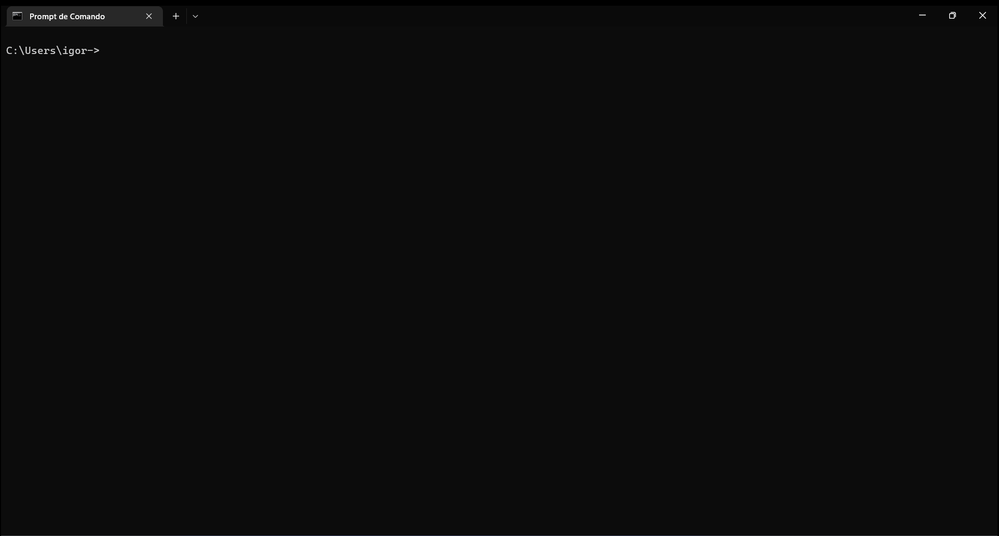

# Rock Paper Scissors Game



A CLI implementation of the rock-paper-scissors game in which you play against the computer.

## Requirements
- 3.10 >= [Python](https://www.python.org/) version < 3.11
- [git](https://git-scm.com/)
- [pipx](https://pypa.github.io/pipx/)

## How to install or just run
    
### Run from a temporary installation

```
pipx run --spec git+https://github.com/ig0r-ferreira/rock-paper-scissors-game.git rpsgame
```

**Warning: when using this option on Windows, display issues due to encoding were observed, but when installing the application, there were no issues.**

### Install

```
pipx install git+https://github.com/ig0r-ferreira/rock-paper-scissors-game.git
```

You will now be able to run the application from anywhere on your system. For that, run:
```
rpsgame
```

## Commands

```
rpsgame                             # Start the game. player_name="You" and rounds=3.
rpsgame -h                          # See the help.                       
rpsgame -n "YOUR NAME"              # Start the game by entering your name.
rpsgame -r 5                        # Start the game by entering the number of rounds.
```
